# RFCP Architecture

This document describes the complete RFCP system architecture and how modules collaborate from GUI orchestration down to device-level execution.

## 1) Full architecture diagram

```mermaid
flowchart TB
  %% ===== Presentation =====
  subgraph GUI[RFCP.GUI - Presentation]
    AppShell[ApplicationShell]
  end

  %% ===== Business =====
  subgraph Business[RFCP.Business - Workflow Orchestration]
    RecipeMgr[RecipeManager]
    ProdMgr[ProductionManager]
    TaskMgr[TaskManager]
  end

  %% ===== Core =====
  subgraph Core[RFCP.Core - Deterministic Control]
    Scheduler[MultiRobotTaskScheduler]
    Pipeline[RobotActionPipeline]
    Executor[RobotExecutor]
    Loop[DeterministicControlLoop]
    Motion[RobotMotionService]
    Calib[VisionCoordinateCalibration]
    StateMachine[SystemStateMachine]
  end

  %% ===== Platform =====
  subgraph Platform[RFCP.Platform + Infrastructure - Cross-Cutting + Integration]
    Logging[LogService]
    Alarm[AlarmManager]
    Config[ConfigurationManager]
    Permission[PermissionManager]
    OpRecord[OperationRecordService]
    ProcRecord[ProcessingRecordService]
    DB[(DatabaseContext)]
    FA[AutomationProtocols]
  end

  %% ===== Device abstraction =====
  subgraph DeviceAbstraction[RFCP.DeviceAbstraction - Hardware Contracts]
    IRobot[IRobot]
    IPLC[IPLC]
    IVision[IVision]
    IConveyor[IConveyor]
    IIO[IIO]
    Models[Models]
  end

  %% ===== Plugin runtime =====
  subgraph Plugins[RFCP.Plugins + Infrastructure.PluginLoader - Runtime Driver Plugins]
    Manifest[PluginManifest]
    DriverContract[IDeviceDriver]
    Loader[PluginLoader]
  end

  %% ===== Drivers =====
  subgraph Drivers[RFCP.Drivers - Vendor Implementations]
    Kuka[KukaRobotDriver]
    ABB[AbbRobotDriver]
    Fanuc[FanucRobotDriver]
    Siemens[SiemensPlcDriver]
    Halcon[HalconVisionDriver]
  end

  %% ===== Physical devices =====
  subgraph Hardware[Industrial Hardware]
    RobotCtrl[Robot Controllers]
    PLC[PLC]
    Vision[Industrial Vision System]
    Conveyor[Conveyor System]
    IO[Digital/Analog I/O]
  end

  %% Presentation to business
  AppShell --> RecipeMgr
  AppShell --> ProdMgr
  AppShell --> TaskMgr

  %% Business to core/platform
  RecipeMgr --> TaskMgr
  ProdMgr --> TaskMgr
  TaskMgr --> Scheduler
  TaskMgr --> StateMachine
  TaskMgr --> Config
  TaskMgr --> Permission

  %% Core control flow
  Scheduler --> Pipeline
  Pipeline --> Executor
  Executor --> Motion
  Motion --> Calib
  Loop --> Scheduler
  StateMachine --> Loop

  %% Platform cross-cutting
  Scheduler --> Logging
  Pipeline --> Logging
  Executor --> Alarm
  Executor --> OpRecord
  Motion --> ProcRecord
  Config --> DB
  OpRecord --> DB
  ProcRecord --> DB
  Alarm --> FA

  %% Core uses abstraction contracts
  Executor --> IRobot
  Executor --> IPLC
  Executor --> IIO
  Motion --> IRobot
  Motion --> IVision
  Motion --> Models
  Scheduler --> IConveyor

  %% Plugin runtime
  Loader --> Manifest
  Loader --> DriverContract
  Executor --> Loader

  %% Drivers implement plugin contracts + interfaces
  Kuka -.implements.-> DriverContract
  ABB -.implements.-> DriverContract
  Fanuc -.implements.-> DriverContract
  Siemens -.implements.-> DriverContract
  Halcon -.implements.-> DriverContract

  Kuka -.implements.-> IRobot
  ABB -.implements.-> IRobot
  Fanuc -.implements.-> IRobot
  Siemens -.implements.-> IPLC
  Halcon -.implements.-> IVision

  %% Drivers control physical hardware
  Kuka --> RobotCtrl
  ABB --> RobotCtrl
  Fanuc --> RobotCtrl
  Siemens --> PLC
  Halcon --> Vision
  IConveyor --> Conveyor
  IIO --> IO
```

## 2) Project/module mapping

- **RFCP.GUI**
  - Entry/presentation composition for operators.
  - Key type: `ApplicationShell`.
- **RFCP.Business**
  - Production and recipe orchestration.
  - Key types: `RecipeManager`, `ProductionManager`, `TaskManager`.
- **RFCP.Core**
  - Deterministic execution engine and action pipeline.
  - Key types: `MultiRobotTaskScheduler`, `RobotActionPipeline`, `RobotExecutor`, `DeterministicControlLoop`, `RobotMotionService`, `VisionCoordinateCalibration`, `SystemStateMachine`.
- **RFCP.Platform + Infrastructure**
  - Logging, alarms, configuration, permissions, operation/processing records, DB, factory protocols.
- **RFCP.DeviceAbstraction**
  - Hardware contracts: `IRobot`, `IPLC`, `IVision`, `IConveyor`, `IIO` and shared models.
- **RFCP.Plugins / PluginLoader**
  - Driver plugin contract + runtime loading (`IDeviceDriver`, `PluginLoader`, `PluginManifest`).
- **RFCP.Drivers**
  - Vendor-specific implementations: KUKA, ABB, FANUC, Siemens PLC, HALCON Vision.

## 3) Dependency rules (enforced architecture intent)

1. **Drivers are plugins**: all concrete hardware drivers are loaded via plugin runtime.
2. **Hardware isolation**: Core/Business code depends on interfaces, not vendor SDKs.
3. **Deterministic control**: task execution runs through scheduler/pipeline/executor/loop primitives.
4. **Action pipeline**: robot tasks are decomposed and executed through `RobotActionPipeline`.
5. **Dependency injection**: all modules are wired by DI for replaceability and testability.

## 4) Runtime execution path (simplified)

1. Operator interacts with **GUI**.
2. **Business** layer converts production intent to executable tasks.
3. **Core** scheduler/pipeline/executor runs deterministic actions.
4. Core requests capabilities via **DeviceAbstraction interfaces**.
5. **PluginLoader** resolves concrete **Driver plugins**.
6. Drivers communicate with **industrial hardware**.
7. **Platform/Infrastructure** captures logs, records, alarms, and external factory integration events.
